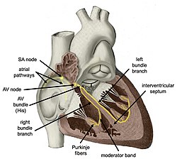

- 심전도가 심박수 아닌가요? (아닙니다)
- 본 글에서는 심전도를 이해하기 위한 가장 기초적인 배경 지식을 소개하려고 합니다.

<!-- more -->

## 심장은 어떻게 뛰나요? - 전기 자극으로요!
심장은 심장 혈액을 전신으로 내보내기 위해 수축과 이완 운동을 반복하는데요, 이러한 운동은 <strong>심장의 전기적 활동</strong>에 의해 유도됩니다. 심장은 스스로 전기 자극을 만들어 내고, 그 전기 자극이 이동하면서 심장 근육을 수축시킵니다. 전기 자극의 이동에 따라 심방과 심실이 적절한 시간과 강도로 수축/이완 활동을 하며 혈액을 전신으로 순환시킵니다.

## 심전도(electrocardiogram; ECG) 검사를 통해 심장의 전기적 활동을 엿볼 수 있습니다.
피부에 전극을 부착하여 <u>심장에서 만들어내는 이러한 전기 자극의 흐름(전위의 변화)를 감지하는 검사</u>가 바로 <strong>심전도 검사</strong>입니다. 측정된 전기적 활동은 선, 파동으로 기록되는데 이렇게 얻어지는 자료가 바로 심전도입니다. 병원에서는 이러한 심전도의 모양을 보고 심장에 질병이 있는지 없는지 진단하게 됩니다.

## 심장은 어떻게 전기를 만들어 내나요? 
심장은 자체적으로 전기적 활동을 할 수 있게 하는 <strong>심장 자극 전도계(cardiac conduction system)</strong>를 갖고 있습니다.

> 심장 그림을 보는 경우, 그림을 보는 사람 기준으로 왼쪽이 실제 심장의 오른쪽이라고 보아야 합니다. 심장을 가진 사람 기준으로 좌/우가 결정되기 때문입니다! 그림에서 보이는 왼쪽 심방은 우심방으로 불리고, 그림 기준에서 오른쪽 심방은 좌심방입니다. 

{: width="200", height="200"}

<i>출처: <a href="https://en.wikipedia.org/wiki/Cardiac_conduction_system">https://en.wikipedia.org/wiki/Cardiac_conduction_system</a></i>/center>